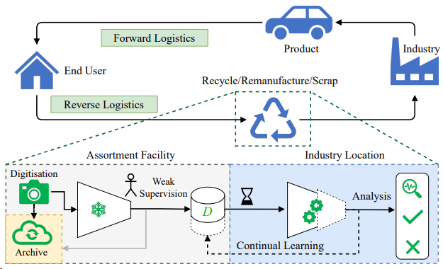
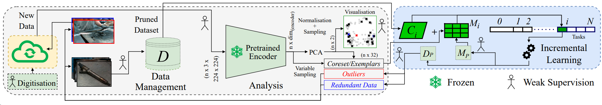

# RECLUSE: Representation Clustering for Continual Learning using SSL Pretrained Encoder

### Application Scenario

The availability of large quantities of data is heavily responsible for the breakthroughs and rapid adoption of Machine Learning (ML). However, data collected in miscellaneous industrial setups tend to be uncurated and heterogeneous, making it time-consuming and expensive to sort through before ML training. This becomes an incrementally compounding issue in Continual Learning projects with long timelines. We leverage the recent advancements in Computer Vision and Self-Supervised Learning (SSL) for data pruning, coreset/exemplar selection, and analysis. We present a straightforward solution to reduce the impact of catastrophic forgetting and data drift on feature representation. We study our approach on relevant industrial datasets. Our approach, RECLUSE (Representation Clustering for Continual Learning using SSL Pretrained Encoder), can be implemented before, during and after the traditional supervised ML training iteratively and in a scalable manner. We explore our implementation with varying constraints, with and without weak supervision. RECLUSE surpasses the current state-of-the-art for exemplar selection, providing an improvement in average incremental accuracy of 1.5% (with DER) to 4.1% (with PODNet) against Herding, and 0.8% on old class data against RMM. We also elaborate on Self-Supervised pertaining (using DINO and VICRegL) for Class-IL applications and observe an improvement in average incremental accuracy of 2.4% to 8.1% for different industrial datasets. Minimising the computational footprint of lifelong learning projects in industrial setups is also a focus of this work. Code implementation is available.

